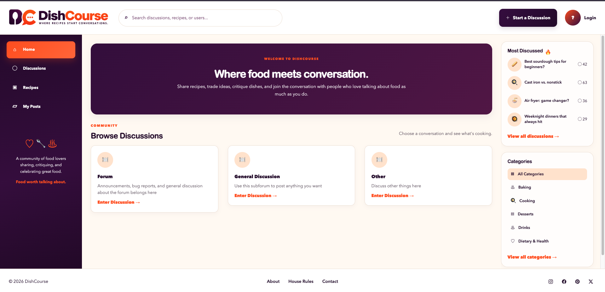

# DishCourse


<p align="center">
  
</p>

    DishCourse is a social discussion forum built for food lovers — from everyday cooks and foodies to social media chefs and anyone who simply enjoys talking about food.

Users can create posts, share recipes and ideas, participate in conversations through comments and reactions, share media, and communicate directly with other members of the community.

DishCourse was developed by the **CircusCircusLimes** team as part of the **Zip Code Wilmington Data Engineering Program**.

---

## Features

### Posts
- Create and view discussion posts
- Create public or private posts
- Use plain text or Markdown formatting
- Add image and video links to posts
- Browse posts within discussion subforums

### Comments & Reactions
- Comment on discussion posts
- React to posts with Like, Dislike, or Heart
- React to comments with Like, Dislike, or Heart
- View reaction counts
- Change an existing reaction
- Remove a reaction by selecting it again

### Communication
- Send direct messages to other users
- Access conversations with other community members

### User Features
- User registration and authentication
- User profiles
- User settings
- Avatar support

### User Interface
- Custom DishCourse branding
- Bootstrap-based interface
- Responsive page layouts
- Navigation for forums, posts, messages, profiles, and settings

---

## Tech Stack

| Technology | Purpose |
|---|---|
| Python | Application programming language |
| Flask | Web application framework |
| Flask-SQLAlchemy | ORM and database integration |
| Flask-Login | User authentication |
| MySQL 8.4 | Relational database |
| PyMySQL | Python MySQL database driver |
| Jinja2 | HTML templating |
| HTML / CSS | Application structure and styling |
| Bootstrap | Responsive UI components |
| JavaScript | Client-side interaction |
| Docker | Application containerization |
| Docker Compose | Multi-container orchestration |
| Gunicorn | Application server |
| Git | Version control |
| GitHub | Team collaboration and pull requests |

---

## Application Architecture

The original Flask forum application was refactored into a modular architecture using **Flask Blueprints**.

Major areas of functionality are separated into modules for:

- Posts
- Comments
- Post reactions
- Comment reactions
- Direct messages
- User settings
- User profiles

SQLAlchemy provides the application's ORM layer and manages communication between the Flask application and MySQL.

Docker Compose provides a consistent application environment consisting of separate web and database services.

### Web Service

The web container runs:

- Flask
- Gunicorn
- DishCourse application code

Gunicorn listens on port `5000` inside the container.

### Database Service

The database container runs:

- MySQL 8.4
- Persistent MySQL data storage
- Docker health checks

MySQL listens on port `3306` inside the container.

---

## Database

DishCourse uses **MySQL 8.4** for persistent application storage.

Application data includes:

- Users
- Subforums
- Posts
- Comments
- Post reactions
- Comment reactions
- Direct messages

Relationships between users, posts, comments, reactions, and messages are managed through SQLAlchemy models.

The MySQL Docker container uses a named volume to preserve database data between container restarts.

---

## Environment Configuration

DishCourse uses environment variables to configure Docker and MySQL.

Create a `.env` file in the project root before starting the application.

Example:

```env
APP_PORT=9101
DB_PORT=9102
COMPOSE_PROJECT_NAME=dishcourse

MYSQL_DATABASE=circuscircuslimes
MYSQL_USER=circus_app
MYSQL_PASSWORD=your_password
MYSQL_ROOT_PASSWORD=your_root_password
```

### Port Configuration

The Docker Compose configuration uses:

```text
APP_PORT → Flask/Gunicorn container port 5000
DB_PORT  → MySQL container port 3306
```

For the S2 deployment:

```text
Web Application: 9101 → 5000
MySQL Database:   9102 → 3306
```

The MySQL host port is bound to `127.0.0.1` so the database is not directly exposed publicly.

> **Important:** The `.env` file contains credentials and must not be committed to GitHub.

---

## Getting Started

### Requirements

Before running DishCourse, install:

- Git
- Docker Desktop

---

### 1. Clone the Repository

```bash
git clone https://github.com/CircusCircusLimes/CircusCircusLimes.git
cd CircusCircusLimes
```

---

### 2. Create the Environment File

Create a `.env` file in the project root and configure the required environment variables.

At minimum, configure:

```text
APP_PORT
DB_PORT
COMPOSE_PROJECT_NAME
MYSQL_DATABASE
MYSQL_USER
MYSQL_PASSWORD
MYSQL_ROOT_PASSWORD
```

---

### 3. Build and Start DishCourse

From the project root:

```bash
docker compose up -d --build
```

Docker Compose will build the DishCourse web application and start both the web and MySQL containers.

---

### 4. Verify the Containers

```bash
docker compose ps
```

Both services should show as running.

The MySQL container should report:

```text
healthy
```

With the S2 port configuration, the port mappings will resemble:

```text
dishcourse-web     0.0.0.0:9101->5000/tcp
dishcourse-mysql   127.0.0.1:9102->3306/tcp
```

---

### 5. Open DishCourse

For a local environment configured with `APP_PORT=9101`:

```text
http://localhost:9101
```

For a server deployment, use the server hostname or IP address with the configured application port.

---

## Docker Commands

### Start / Build

```bash
docker compose up -d --build
```

### View Container Status

```bash
docker compose ps
```

### Stop the Application

```bash
docker compose down
```

### Restart Containers

```bash
docker compose restart
```

### View Web Application Logs

```bash
docker compose logs web
```

### View Recent Web Logs

```bash
docker compose logs web --tail=100
```

### View Database Logs

```bash
docker compose logs db
```

---

## S2 Server Deployment

DishCourse is configured to run in the team's assigned S2 server environment using Docker Compose.

The assigned ports are:

| Service | Host Port | Container Port |
|---|---:|---:|
| DishCourse Web | 9101 | 5000 |
| MySQL | 9102 | 3306 |

The `.env` file must also be created on the server because environment files containing credentials are not stored in GitHub.

From the DishCourse project directory on S2:

```bash
docker compose up -d --build
docker compose ps
```

The application can be tested directly from the server with:

```bash
curl http://localhost:9101
```

A successful HTML response confirms that the DishCourse web application is responding through the assigned application port.

---

## Development Workflow

The CircusCircusLimes team used a branch-based Git/GitHub workflow.

```text
Feature / Personal Branches
           ↓
          dev
           ↓
          main
```

Team members developed features independently on personal or feature branches.

Completed work was:

1. Committed to the working branch
2. Pushed to GitHub
3. Submitted through a pull request
4. Merged into `dev`
5. Integrated and regression tested
6. Promoted from `dev` to `main`

The final DishCourse demo build was promoted to `main` after successful integration and regression testing.

---

## Branches

### `main`

The stable release and demo version of DishCourse.

### `dev`

The team's integration branch where completed features were combined and tested before release.

### Feature / Personal Branches

Used by individual team members to develop features before submitting them to `dev` through pull requests.

---

## Testing

The completed application underwent team regression testing after all planned features were integrated.

Testing included:

- User registration
- User authentication
- Post creation
- Public posts
- Private posts
- Plain-text posts
- Markdown-formatted posts
- Image and video links
- Comments
- Post reactions
- Comment reactions
- Reaction counts
- Reaction updates and removal
- Direct messaging
- User profiles
- User settings
- Avatar functionality
- Navigation
- Docker container startup
- MySQL connectivity
- Database persistence
- Integrated application functionality

The final `main` build was also smoke tested after the final team merge.

---

## Project Evolution

DishCourse began as an existing Flask forum application and was expanded and modernized by the CircusCircusLimes team.

The project included:

- Refactoring the Flask application into modular components
- Implementing Flask Blueprints
- Migrating database functionality to MySQL
- Containerizing the application with Docker
- Creating a shared Docker Compose environment
- Adding public and private posts
- Adding plain-text and Markdown post support
- Adding image and video media support
- Adding comments
- Adding post reactions
- Adding comment reactions
- Adding direct messaging
- Expanding user profiles
- Adding user settings
- Supporting user avatars
- Creating the DishCourse brand and interface
- Integrating team-developed features through GitHub pull requests
- Performing regression testing on the integrated application
- Preparing the application for deployment to the S2 server environment

The project provided hands-on experience working with an existing codebase while introducing new functionality, database infrastructure, containerization, collaborative Git workflows, integration testing, and server deployment.

---

## Team

**CircusCircusLimes**

- Leigh
- Monah
- Sloane

Developed as part of the **Zip Code Wilmington Data Engineering Program**.

---

## Project Status

### Final Demo Build — Complete

All planned DishCourse features have been:

- Developed
- Integrated
- Merged
- Regression tested
- Promoted to `main`
- Containerized with Docker
- Configured for the S2 server environment

The final application is ready for demonstration.